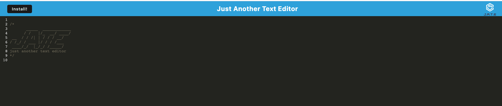

# friendly-eureka

## Just Another Text Editor - Challenge Assignment 19 PWA

- *What was your motivation?*  I wanted to be able to create a text to be able to use online or offline
- *What problem does it solve?*  It solves the problem of needing to find a text editor
- *What did I learn?* I learned how to create set up a webpack.config file, and an src-sw file. 

## Installation

*What are the steps required to install your project? Provide a step-by-step description of how to get the development environment running.*

Download all of the files from the repo. Then from your terminal run 'npm i' to install the packages associated with this project. 

## Usage

*Provide instructions and examples for use. Include screenshots as needed.*

To run the application locally, after you have downloaded the files and completed the installation steps above. From your terminal you will want to run 'npm start:dev' to start the server, and then go to localhost:3000.

Alternatively, it is deployed to Heroku at https://friendly-eureka.herokuapp.com/

Below is a screenshot of the page when you first go to it  

## Credits
I used the activities and office hours to assist with issues with my database.js file as well as deployment to Heroku.
